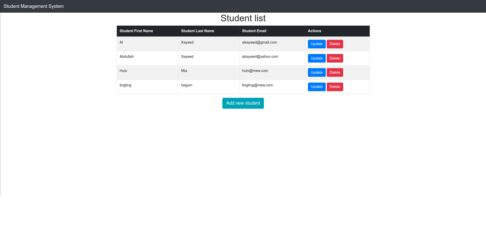
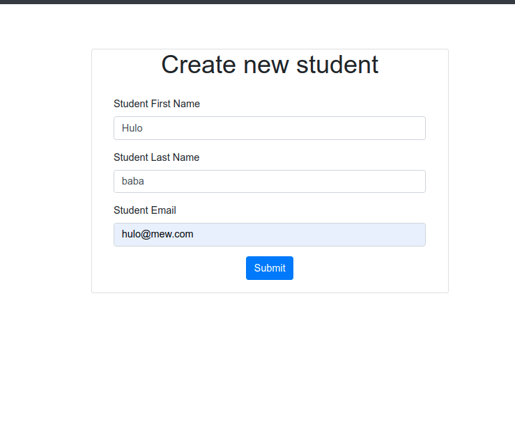
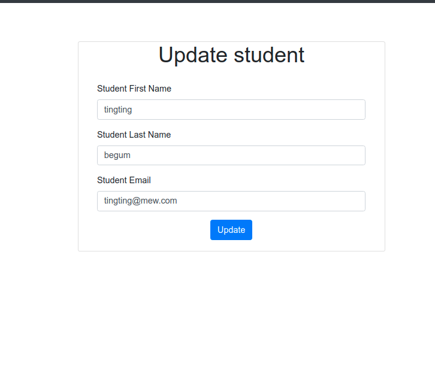

# Student Management System

## A simple CRUD functionality in student module

<hr>

## Demo

<table>
  <tr>
    <td>List</td>
  </tr>
  <tr>
    <td></td>
  </tr>

   <tr>
    <td>Add record</td>
  </tr>
  <tr>
    <td></td>
  </tr>

  <tr>
    <td>Update record</td>
  </tr>
  <tr>
    <td></td>
  </tr>
   
 </table>
<br/><hr><br/>

## Stacks

- Java
- Springboot
- PostgreSQL
- Thymeleaf
- Bootstrap

<br/><hr><br/>

## Features

```
1. show student list
2. add new student
3. update student record
4. delete student
```

<br/><hr><br/>
